# Production-Grade Kubernetes & Terraform Cloud Platform


A cloud-native DevOps platform built to demonstrate production-level Kubernetes orchestration, Docker containerization, Terraform infrastructure provisioning, CI/CD automation, monitoring, and scalable microservices deployment using live cryptocurrency market data.

> **Note:** This project provisions AWS infrastructure using Terraform and EKS. Running this project on AWS may create costs. Destroy resources after testing using `terraform destroy`.

---

# Project Overview

This project is a scalable crypto price tracking platform deployed on AWS EKS. Users can request live cryptocurrency prices through a FastAPI backend service. The API sends jobs into a Redis queue, worker containers process the jobs using the CoinGecko API, and processed data is stored inside PostgreSQL.

The platform is fully containerized with Docker, orchestrated using Kubernetes, provisioned with Terraform, monitored using Prometheus and Grafana, integrated with AWS CloudWatch logging, and deployed on Amazon EKS.

---

# Business / Use Case

Crypto market platforms need reliable, scalable, and automated systems to collect, process, and expose live market data. This project demonstrates how a production-style cloud-native platform can handle crypto price tracking using microservices, queues, databases, monitoring, and automated deployment.

The same architecture can be adapted for fintech dashboards, trading analytics, price alert systems, portfolio tracking tools, and real-time financial data pipelines.

---

# Tech Stack

- Python
- FastAPI
- Docker
- Docker Compose
- Redis
- PostgreSQL
- Kubernetes
- AWS EKS
- Terraform
- Nginx Ingress Controller
- Horizontal Pod Autoscaler (HPA)
- Prometheus
- Grafana
- AWS CloudWatch
- GitHub Actions
- Docker Hub

---

# Docker Images

The application images are published on Docker Hub.

```text
API Image:
https://hub.docker.com/r/khalil1545/crypto-api

Worker Image:
https://hub.docker.com/r/khalil1545/crypto-worker
```

---

# Production Architecture

```text
User Request
      |
      v
AWS LoadBalancer / Ingress
      |
      v
FastAPI Service (Kubernetes Pods)
      |
      v
Redis Queue
      |
      v
Worker Pods
      |
      v
CoinGecko API
      |
      v
PostgreSQL Database
      |
      v
Prometheus + Grafana Monitoring
      |
      v
AWS CloudWatch Logging
```

---

# Repository Structure

```text
infra/              Terraform infrastructure files
k8s/                Kubernetes manifests
services/api/       FastAPI backend service
services/worker/    Worker microservice
monitoring/         Monitoring configuration
images/             Architecture and deployment screenshots
.github/            GitHub Actions workflows
```

---

# Features

- Live cryptocurrency price tracking
- CoinGecko API integration
- Redis queue-based processing
- Worker microservice architecture
- PostgreSQL data persistence
- Docker containerization
- Kubernetes orchestration
- AWS EKS deployment
- Terraform infrastructure provisioning
- ConfigMaps and Secrets
- Rolling update deployments
- Liveness and readiness probes
- Horizontal Pod Autoscaling
- Ingress-based routing
- Prometheus metrics collection
- Grafana monitoring dashboards
- AWS CloudWatch integration
- GitHub Actions CI/CD automation

---

# API Endpoints

```text
GET  /health
GET  /price/{coin}
POST /track/{coin}
GET  /metrics
GET  /docs
```

Examples:

```text
GET  /price/bitcoin
POST /track/ethereum
```

---

# Public Deployment URLs

> These public endpoints are available only while the AWS EKS infrastructure is running.

Swagger Documentation:

```text
http://ae55e7c83580346679cf02f3afb46863-1159999103.us-east-1.elb.amazonaws.com:8000/docs
```

Health Endpoint:

```text
http://ae55e7c83580346679cf02f3afb46863-1159999103.us-east-1.elb.amazonaws.com:8000/health
```

---

# Local Docker Setup

Run:

```bash
docker compose up --build
```

Open:

```text
http://localhost:8000/docs
```

---

# Kubernetes Deployment

Apply Kubernetes manifests:

```bash
kubectl apply -f k8s/namespace.yaml
kubectl apply -f k8s/configmap.yaml
kubectl apply -f k8s/secrets.yaml
kubectl apply -f k8s/redis-deployment.yaml
kubectl apply -f k8s/postgres-deployment.yaml
kubectl apply -f k8s/services.yaml
kubectl apply -f k8s/api-deployment.yaml
kubectl apply -f k8s/worker-deployment.yaml
kubectl apply -f k8s/hpa.yaml
kubectl apply -f k8s/ingress.yaml
```

Check cluster resources:

```bash
kubectl get pods -n crypto-platform
kubectl get svc -n crypto-platform
kubectl get hpa -n crypto-platform
```

---

# Terraform Infrastructure Deployment

Terraform provisions:

- AWS VPC
- Public subnets
- EKS cluster
- Managed node groups
- Security groups
- IAM integrations

Terraform workflow:

```bash
terraform init
terraform plan
terraform apply
```

---

# Cost Note

This project uses AWS EKS, EC2 worker nodes, LoadBalancer, and related cloud resources. These services may create charges while running.

To avoid unnecessary AWS costs, destroy the infrastructure after testing or demo completion.

---

# How to Destroy Infrastructure

Go to the Terraform directory:

```bash
cd infra
```

Run:

```bash
terraform destroy
```

Type:

```text
yes
```

After destroy is complete, verify in AWS Console that the following resources are removed:

- EKS cluster
- Node groups
- EC2 instances
- LoadBalancer
- Security groups
- VPC resources
- NAT gateway if created

---

# Monitoring & Observability

Prometheus and Grafana are deployed using Helm on Kubernetes.

Install monitoring stack:

```bash
helm install monitoring prometheus-community/kube-prometheus-stack -n monitoring --create-namespace
```

Open Grafana:

```bash
kubectl port-forward svc/monitoring-grafana 3000:80 -n monitoring
```

Grafana Dashboard:

```text
http://localhost:3000
```

Monitoring includes:

- Kubernetes cluster metrics
- Pod resource usage
- Node monitoring
- API metrics
- Worker metrics
- Infrastructure observability

CloudWatch log groups are configured for AWS EKS cluster logging.

---

# CI/CD Pipeline

GitHub Actions pipeline automatically runs on every push to the main branch.

Pipeline tasks:

- Checkout repository
- Install dependencies
- Build Docker images
- Validate deployment workflow

---

# Production Practices Implemented

- Microservices architecture
- Containerized workloads
- Kubernetes orchestration
- Infrastructure as Code (Terraform)
- AWS cloud deployment
- Autoscaling
- Readiness and liveness probes
- Centralized monitoring
- Cloud logging
- CI/CD automation
- Rolling deployments
- Ingress routing
- Secrets management

---

# Screenshots

## AWS EKS Cluster Ready

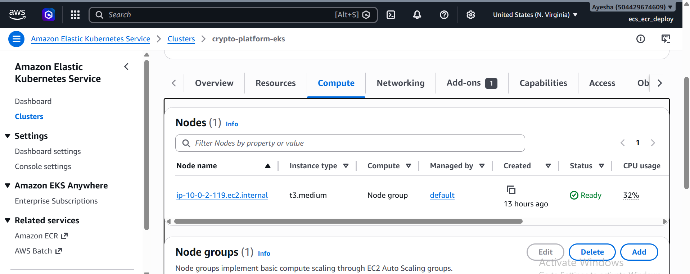

---

## Kubernetes Worker Nodes

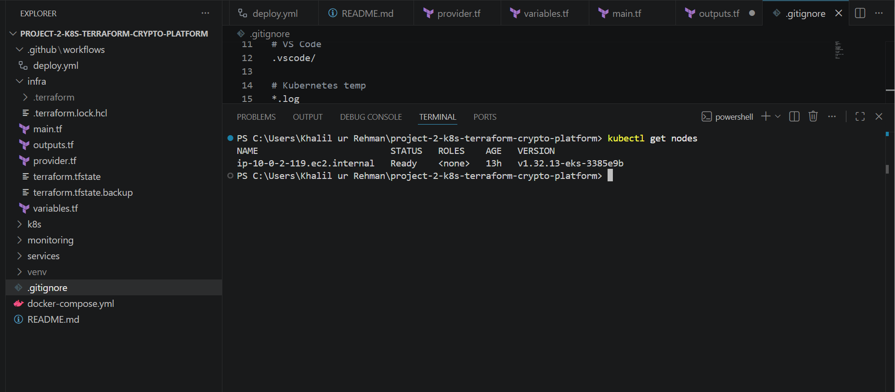

---

## Running Application Pods

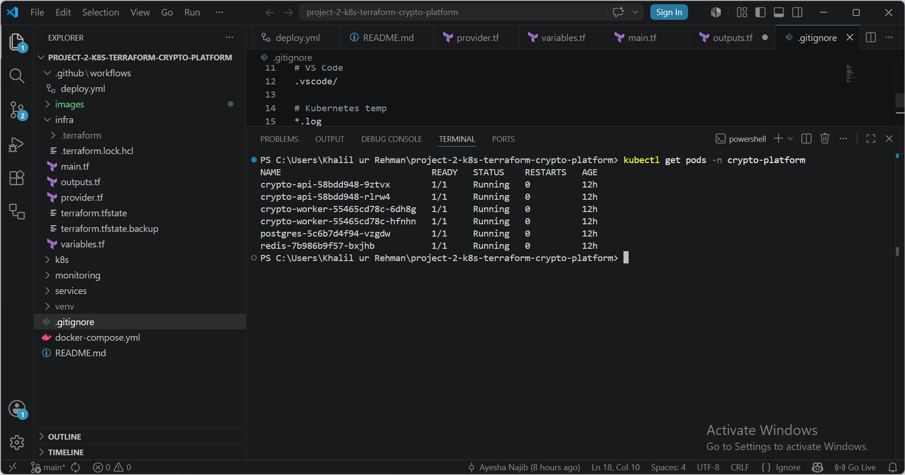

---

## Kubernetes Services

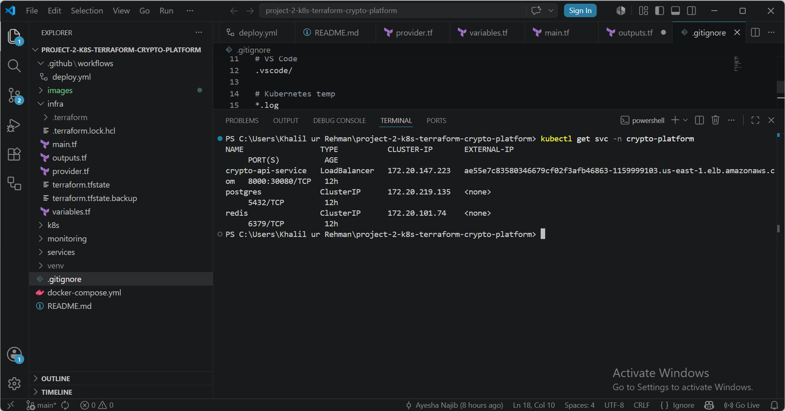

---

## FastAPI Swagger Documentation

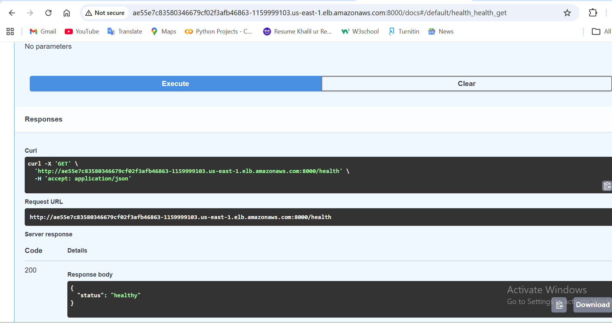

---

## FastAPI Endpoints Working

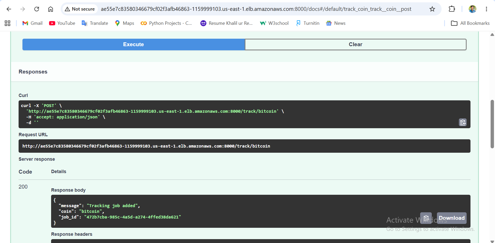

---

## Ingress & Public Access

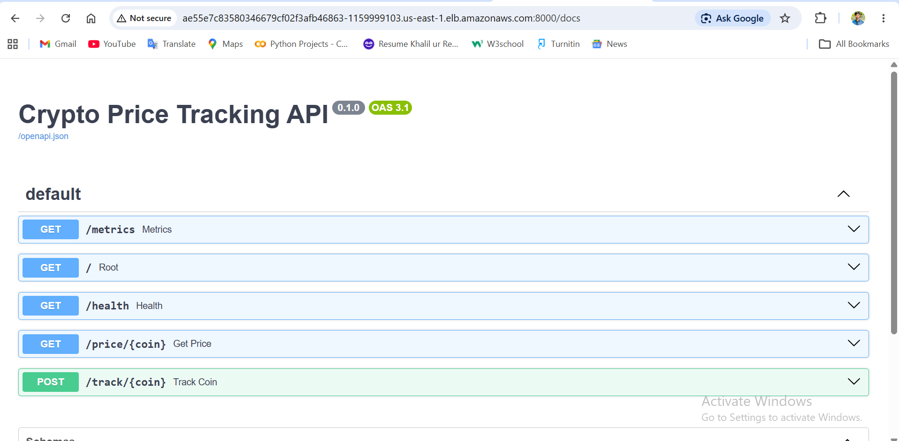

---

## Horizontal Pod Autoscaler (HPA)

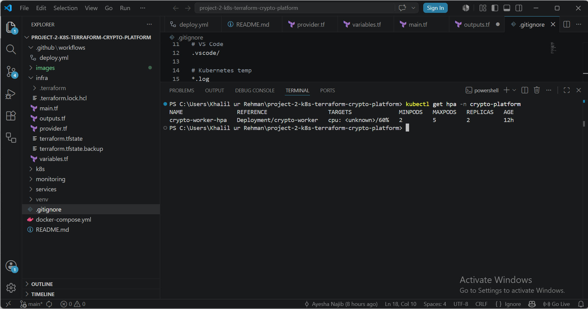

---

## Redis & PostgreSQL Services

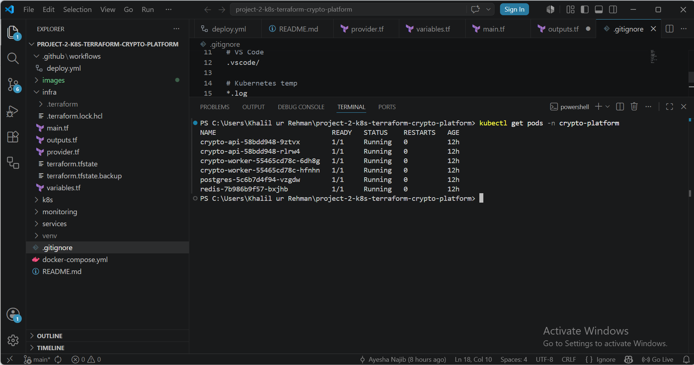

---

## Grafana & Prometheus Monitoring

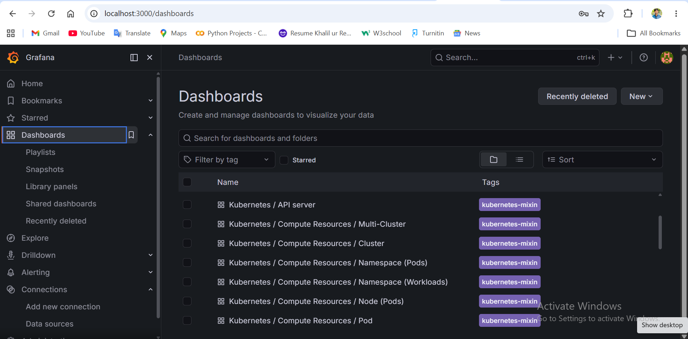

---

## AWS CloudWatch Logs

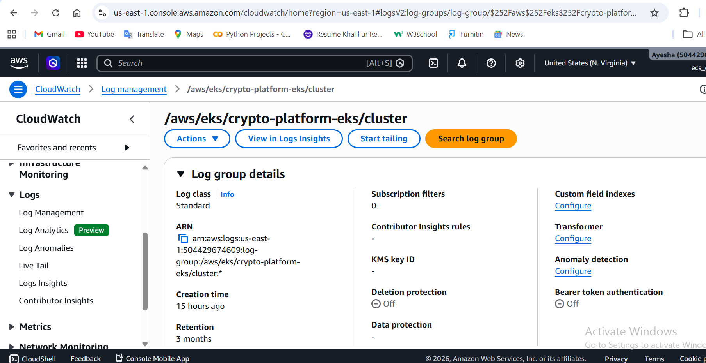

---

## GitHub Actions CI/CD Pipeline

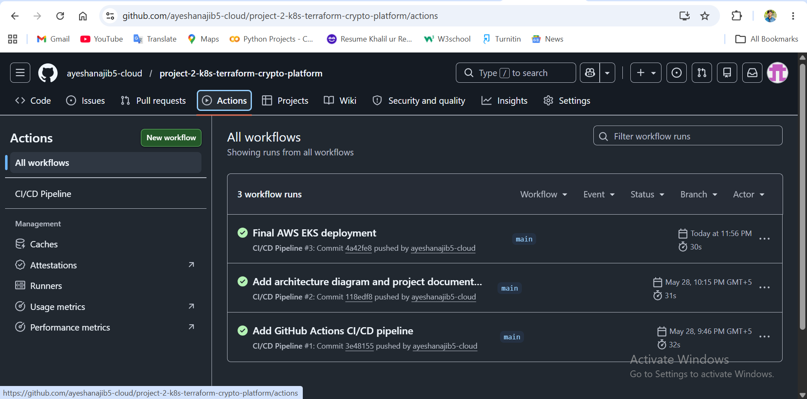

---

## System Architecture Diagram

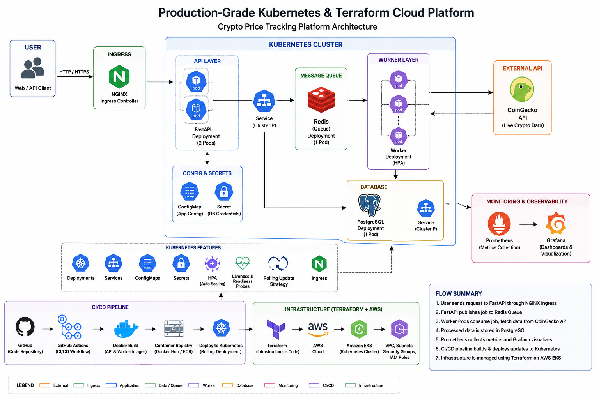

---

# Future Improvements

- Amazon ECR integration
- HTTPS with cert-manager
- ArgoCD GitOps deployment
- AWS IAM least-privilege roles
- Terraform remote state with S3 and DynamoDB
- API authentication and rate limiting
- Advanced alerting rules
- Multi-environment deployment strategy

---

# Final Status

Production-grade Kubernetes deployment is fully operational on AWS EKS.

Completed successfully:

- AWS EKS deployment
- Terraform infrastructure provisioning
- Kubernetes orchestration
- Docker containerization
- Prometheus monitoring
- Grafana dashboards
- CloudWatch logging
- GitHub Actions CI/CD
- Public API deployment
- Horizontal Pod Autoscaling
- Redis & PostgreSQL integration